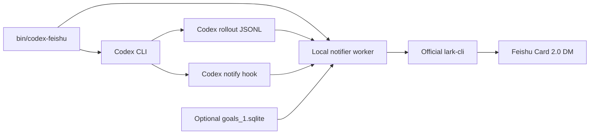

# Codex Feishu Notifier

Send OpenAI Codex CLI task lifecycle updates to Feishu/Lark as pinned,
updatable Card 2.0 messages.

Codex 启动后，只有在用户真正发送任务时才创建卡片。任务运行期间更新同一张卡片；完成或中断后更新状态、取消 Pin，并通过应用内加急提醒手机端。

## Features

- One card per normal Codex turn.
- One persistent card per Codex Goal, across automatic continuation turns.
- Pin only while a task is active; automatically remove stale Pins.
- Blue running, green completed, red interrupted, and grey archived cards.
- App urgent notifications on start, completion, and interruption.
- Organized task goals from Codex's public execution summary instead of raw prompts.
- Live progress, sanitized tool activity, elapsed time, terminal, and workspace.
- Manual `turn_aborted`, lost process, clean completion, and Goal terminal states.
- No webhook server and no public inbound endpoint.

## Requirements

- Linux or macOS
- Python 3.8+
- Node.js 18+ and npm
- [OpenAI Codex CLI](https://github.com/openai/codex) 0.145.0 or newer
- A Feishu/Lark custom app with bot capability

## Quick Start

1. Create and publish a Feishu/Lark app by following [docs/feishu-app.md](docs/feishu-app.md).
2. Clone and configure the notifier:

```bash
git clone https://github.com/aplish064/codex-feishu-notifier.git
cd codex-feishu-notifier
./setup.sh
```

3. Enter a monitored workspace and launch Codex through the wrapper:

```bash
cd /path/to/your/workspace
/path/to/codex-feishu-notifier/bin/codex-feishu
```

The wrapper preserves your normal Codex configuration and only overrides the
`notify` hook for that process. Existing Codex processes are not retroactively
attached; restart them through the wrapper once.

## Commands

```bash
# Launch a monitored interactive Codex session
bin/codex-feishu

# Pass normal Codex arguments through unchanged
bin/codex-feishu -C /path/to/project
bin/codex-feishu exec "run the test suite"

# Inspect tracked sessions
bin/status

# Validate local configuration and official lark-cli credentials
source ~/.local/share/codex-feishu-notifier/config.env
python3 notifier.py doctor

# Send one non-urgent test card
python3 notifier.py test
```

Set a clearer terminal label for a launch:

```bash
CODEX_TASK_NAME="payment-api" bin/codex-feishu
```

## Notification Model

| Node | Card action | Pin | Phone urgent |
|---|---|---:|---:|
| User submits a task | Create/update running card | Add | Yes |
| Progress | Patch the current card | Keep | No |
| Completed | Patch to green | Remove | Yes |
| Interrupted/lost | Patch to red | Remove | Yes |
| Goal continues next turn | Reuse Goal card | Keep | No extra card |

Completing an automatic turn inside an active Goal is progress, not a Goal
completion. It patches the existing card without an urgent notification. Only
the initial Goal start and terminal Goal states (complete, interrupted, paused,
blocked, or limited) alert the phone.

Disable individual urgent nodes in the private `config.env`:

```bash
URGENT_ON_STARTED=false
URGENT_ON_COMPLETED=true
URGENT_ON_STOPPED=true
```

## How It Works



Runtime state is stored outside the repository at
`~/.local/share/codex-feishu-notifier/`. See [docs/architecture.md](docs/architecture.md)
for lifecycle and data details.

## Privacy and Security

- App Secret and tokens are managed by the official `@larksuite/cli` inside an
  isolated, private state directory.
- Raw tool inputs and hidden reasoning are never copied to Feishu.
- User prompts are not used verbatim as card goals.
- Runtime sessions, cards, logs, SQLite files, tokens, and `config.env` are
  ignored by Git.
- Use a dedicated app with only the scopes listed in the setup guide.

## Development

```bash
python3 -m unittest discover -s tests -p 'test_*.py' -v
python3 -m py_compile notifier.py tests/test_notifier.py
```

## License

MIT
